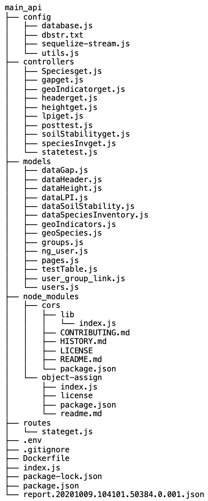

# main_api

[Brief description]

&nbsp;

## Contents

  - [Summary](#Summary)
  - [File Structure](#File-Structure)
  - [Introduction](#Introduction)
  - [Dependencies](#Dependencies)
  - [Endpoints](#Endpoints)
  - [Query Parameters](#Query-Parameters)
  - [Usage](#Usage)
  - [Examples](#Examples)
    - [Using Postman](#Using-Postman)
    - [Using cURL](#Using-cURL)
  - [License](#License)
  - [Resources](#Resources)

&nbsp;

## Summary

&nbsp;

## File Structure

File structure current as of June 2, 2021. Directory `node_modules` excluded.

&nbsp;

## Introduction

&nbsp;

## Dependencies

&nbsp;

## Endpoints

&nbsp;

## Usage

&nbsp;

## Examples

### Using [Postman](https://www.postman.com/)

### Using [cURL](https://curl.se/)

&nbsp;

## Query Parameters

&nbsp;

## License

&nbsp;

## Resources

&nbsp;
