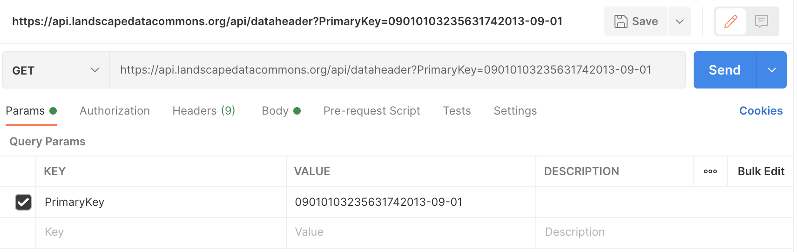

# `main_api`

Landscape Data Commons (LDC) `main_api`, a RESTful API, offers endpoints and query parameters to access the data in the LDC database collection. Endpoints correspond to database tables; query parameters and JSON response properties (generally) correspond to database table columns.
&nbsp;

## Contents

  - [Summary](#Summary)
  - [File Structure](#File-Structure)
  - [Introduction](#Introduction)
  - [Dependencies](#Dependencies)
  - [Resources](#Resources)
  - [Usage](#Usage)
  - [Examples](#Examples)
    - [Using Postman](#Using-Postman)
    - [Using cURL](#Using-cURL)
    - [Using Python](#Using-Python)
    - [Using JavaScript](#Using-JavaScript)
    - [Response](#Response)
  - [License](#License)
  - [Resources](#Resources)

&nbsp;

## Summary

This document describes the LDC `main_api` RESTful API. The `main_api` provides users with access to the data currently found in the `gisDB` database; additional access points to the AERO and MET databases will be added at a later date. Most query parameters and JSON response properties correspond to database table columns; see [/docs/main_api_map.md](/docs/main_api_map.md) for details. The current version of `main_api` supports `GET` requests only.

&nbsp;

## File Structure


File structure current as of June 2, 2021. Directory `node_modules` excluded.

&nbsp;

## Dependencies

Not yet determined.

&nbsp;


## Usage

The current version of `main_api` supports `GET` requests. The API is intended for use with web front ends and for application integration. See the following section for simple `GET` request examples.

&nbsp;

## Examples

The examples below send `GET` requests with the PrimaryKey query parameter to the `dataHeader` `main_api` endpoint. See the `main_api` endpoint/query-parameter and the API tests file for additional information. The valid JSON response to each of the requests is given at the end of this section. The cURL, Python, and JavaScript requests were generated using [Postman](https://www.postman.com/).

&nbsp;

### Using [Postman](https://www.postman.com/)

The screenshot below is for Postman version 8.5.1.


&nbsp;

### Using [cURL](https://curl.se/)

```
curl --location --request GET 'https://api.landscapedatacommons.org/api/dataheader?PrimaryKey=09010103235631742013-09-01' \
--header 'Content-Type: application/json' \
--data-raw '{
    "text": "Text"
}'
```
&nbsp;

### Using [Python](https://www.python.org/)

The code below uses the [http.client](https://docs.python.org/3/library/http.client.html) module.
```
import http.client
import json

conn = http.client.HTTPSConnection("api.landscapedatacommons.org")
payload = json.dumps({
  "text": "Text"
})
headers = {
  'Content-Type': 'application/json'
}
conn.request("GET", "/api/dataheader?PrimaryKey=09010103235631742013-09-01", payload, headers)
res = conn.getresponse()
data = res.read()
print(data.decode("utf-8"))
```
&nbsp;

### Using [JavaScript](https://developer.mozilla.org/en-US/docs/Web/JavaScript)

The code below uses the [Fetch](https://developer.mozilla.org/en-US/docs/Web/API/Fetch_API) API.
```
var myHeaders = new Headers();
myHeaders.append("Content-Type", "application/json");

var raw = JSON.stringify({
  "text": "Text"
});

var requestOptions = {
  method: 'GET',
  headers: myHeaders,
  body: raw,
  redirect: 'follow'
};

fetch("https://api.landscapedatacommons.org/api/dataheader?PrimaryKey=09010103235631742013-09-01", requestOptions)
  .then(response => response.text())
  .then(result => console.log(result))
  .catch(error => console.log('error', error));
```
&nbsp;

### Response

```
[
    {
        "PrimaryKey": "09010103235631742013-09-01",
        "SpeciesState": "NV",
        "PlotID": "Muddy River 04",
        "PlotKey": "0901010323563174",
        "DBKey": null,
        "EcologicalSiteId": "R030XB005NV",
        "Latitude_NAD83": "36.58269697",
        "Longitude_NAD83": "-114.62986283",
        "State": "NV",
        "County": "Clark",
        "DateEstablished": "2013-04-07T00:00:00.000Z",
        "DateLoadedInDb": "2021-02-04T00:00:00.000Z",
        "ProjectName": "Nevada SNDO 2013",
        "ProjectKey": "AIM",
        "LocationType": null,
        "DateVisited": null,
        "PercentCoveredByEcoSite": null,
        "wkb_geometry": "0101000020E610000039F42FAC4FA85CC06CD076D0954A4240"
    }
]
```

&nbsp;

## License

Not yet determined.

&nbsp;

## Related Links

[LDC API](https://api.landscapedatacommons.org/) 
&nbsp;

[LDC API Swagger document](https://api.landscapedatacommons.org/api-docs/)

&nbsp;
